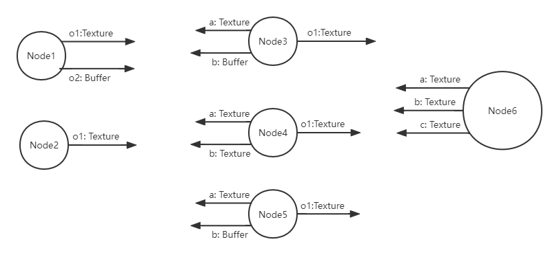
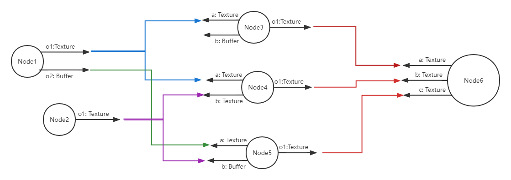
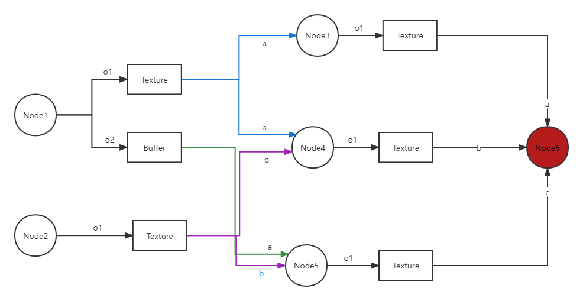
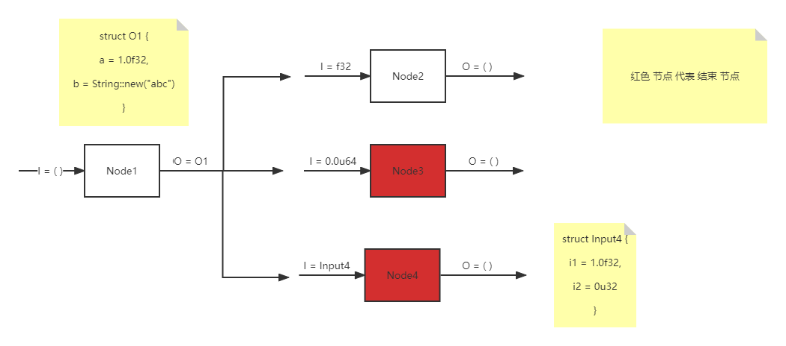

# 依赖图模型

模块 src/depend_graph

## 1、背景：一的渲染图

概念：有向无环图 DAG

+ 节点
+ 节点 的 输入输出槽 Slot；
+ 边：槽之间的依赖；

分三个阶段：

+ setup 声明
+ build/compile 构建 / 编译
+ run/exec 执行

### 1.1、声明

定义 节点 和 输入输出槽



通过 槽位 建立 依赖关系



### 1.2、构建 / 编译

有些引擎 从 没有输出 的 节点 开始，有些引擎要显示指定哪些节点一定要运行的； 

+ 当 声明完毕，构建 渲染图；
+ 构建期间，执行 每个节点的 build 方法；
+ 目的：确定哪些 节点目前用不到，哪些 输出槽位 目前用不到
    - 释放 对应资源，减少 存储空间；



### 1.3、执行

+ 根据 构建后的 那个 依赖图，并行执行 对应节点的 run 方法；
+ 输出参数 需要 Clone
    - 及时 删除 输入输出参数，减少 GPU 开销；
    - 必要时候 利用 信号量，GPU级别的资源同步；免得堵塞 CPU

### 2、depend_graph 的 图模型



### 1.3、和 其他渲染图 的 区别

+ 节点的 输入、输出 参数 只有一个类型，没有显示指定 槽位
+ 只能  显示指定 节点间 的 依赖 （没有 槽位，自然也不能指定槽位的依赖）
+ 需要时，可以用属性宏指定结构体的字段为槽位，槽位的依赖 通过 类型 来 自动匹配
+ 通过 输入收集器，可以将 多个前置节点的 相同类型的 输出，收集起来； 

## 2、例子

+ 根据需求，定义 结构体，并为它们分别实现 DependNode
+ 声明
    - 创建 DependGraph，将 上述 结构体 作为 节点 扔到 图中
    - 指定 节点间的 执行 依赖关系
    - 指定 哪些节点 是 结束 节点
+ 构建：调用 build 方法，构建图；
    - 如果拓扑结构有变化，会调用每个节点的 build 回调
+ 执行：调用 run 方法，并行执行 图
    - 会调用每个节点的 run回调

下面举个 算数表达式的例子，利用 图 计算 表达式：

(a + b) * (c + d)，并 打印 结果；

### 2.1、定义 节点

1、定义 输入结构，二元数据

``` rs

pub struct AddOp1(pub i32);

pub struct AddOp2(pub i32);

struct Binary {
    
    pub a: AddOp1,
    
    pub b: AddOp2,
}

```

2、定义 加法节点，输入来自用户

``` rs

// 加法 节点
struct Add {
    data: Binary
}

impl Default for Add {
    fn default() -> Self {
        Self { data: Binary {a: 0, b: 0} }
    }
}

impl Add {
    pub new(a: i32, b: i32) -> Self {
        Self { data: Binary {a, b} }
    }
}
```

2、为 InputAdd 实现 DependNode

``` rs
impl DependNode for InputAdd {
    // 有输入，用 输入的 Binary；
    // 没有输入用 data
    type Input = Binary;

    type Output = i32;

    fn run<'a>(
        &'a mut self,
        input: &Self::Input,
        usage: &'a ParamUsage,
    ) -> pi_futures::BoxFuture<'a, Result<Self::Output, String>> {
        
        // 根据 拓扑结构判断
        // 如果 Input 的 Binary 对应的 字段 被前置节点填充，则表示 该节点 是计算的中间节点，用 前面的字段做输入
        let data = if usage.is_input_fill(TypeId::of::<Binary>()) {
            &input.data
        } ekse {
            &self.data
        }


        // 输入：空元组 没前缀节点填，为 false
        assert!(!usage.is_input_fill());

        // 输出：f32 有 后继节点使用，为 true
        assert!(usage.is_output_usage(TypeId::of::<f32>()));

        // 输出：u64 根本 不属于 该输出，自然不会有 后继节点使用，为 false
        assert!(!usage.is_output_usage(TypeId::of::<u64>()));

        Box::pin(async move {
            println!("======== Enter Async Node1 Running");
            Ok(30.25)
        })
    }
}
```
#### 加法节点

### 2.2、声明：创建 DependGraph，加入 节点

### 2.3、声明：指定 节点 依赖

### 2.4、声明：指定 结束节点

### 2.5、声明：指定 结束节点


## 3、主要概念

### 3.1、node 图 节点

+ trait `DependNode` 图节点的 对外接口
    - 关联类型：`Input`, `Output`
+ `NodeId` 节点的id
+ `NodeLabel` 节点标示，可以用 NodeId 或 String
+ `ParamUsage` 节点 输入输出参数 的 用途

### 3.2、param 节点的 输入输出 参数

+ trait `InParam`
+ trait `OutParam`
+ 输入 收集器 `InParamCollector`

### 3.3、graph 图模型

+ trait `DependGraph`

## 4、graph 渲染图

主要 利用 depend_graph 来实现 渲染图

### 4.1、概述
